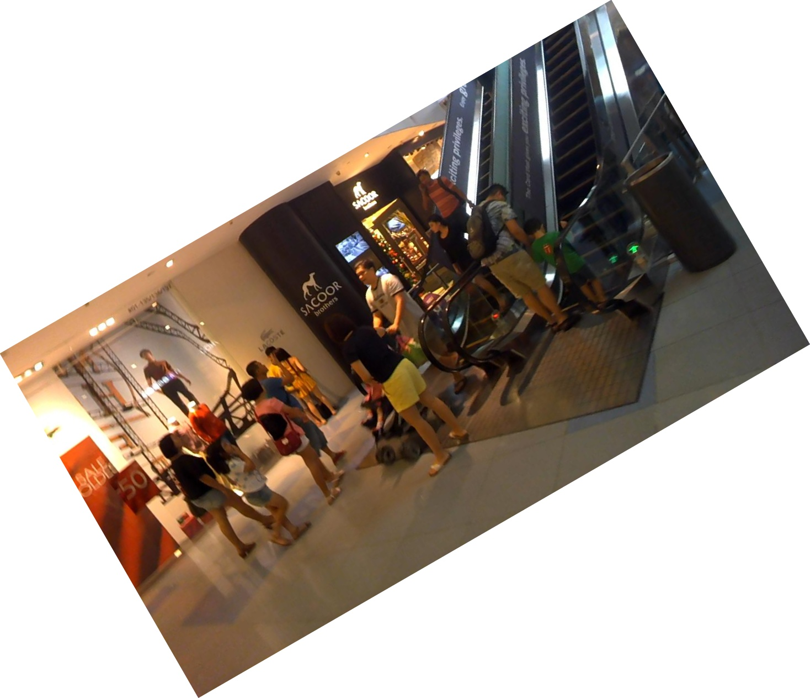
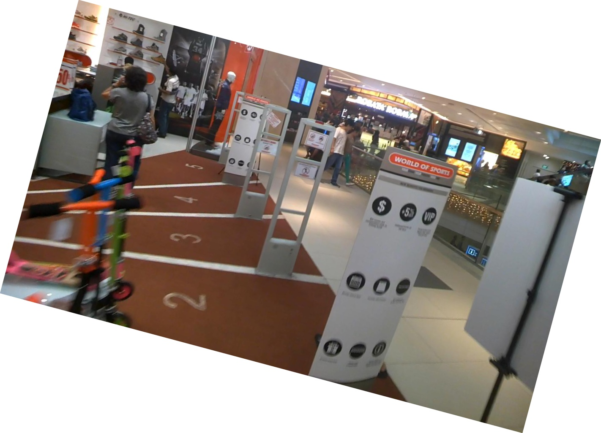

# Data_augmentation
Rotating augmentation of ICDAR2015

对原有的ICDAR2015数据集进行旋转数据增强，进行角度为[-90，-75, -60, -45, -30, -15, 0, 7.5, 15, 30, 45, 60, 75, 90]的旋转增强，  
使得原来1000的训练集扩充到13000，也使得数据集的分布更加自然，这样去训练算法，也能是算法更加鲁棒性。  
```
cd Data_augmentation/
python data_augmentation.py
```

## 旋转增强的样图如下：
  
  

